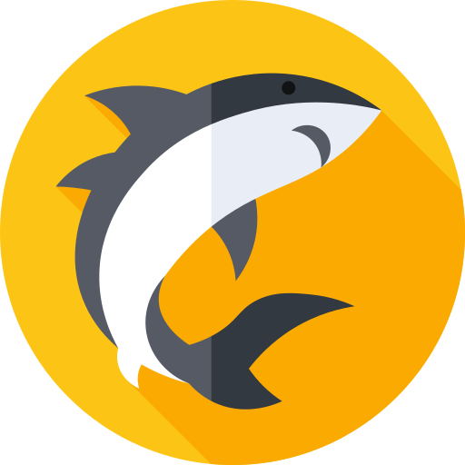

<p align="center">
    
</p>

<h1 align="center">Shop Shark</h1>

The Shop Shark is an innovative Software as a Service (SAAS) application that empowers shops to create their own personalized online catalog pages. By offering a range of SAAS plans tailored to meet the unique needs of each shop, we ensure that our platform caters to a wide variety of businesses.

Our primary focus is on providing a seamless browsing and purchasing experience for customers visiting these shop catalog pages. Customers can effortlessly explore the extensive product offerings and easily place orders through the intuitive interface.

### Contexts: 

The application distinguishes between different user types to streamline their interactions within specific contexts:

1. **Shop Customers (Shop Context)**: These are the individuals who browse the catalog with the intention of finding and purchasing products. They can effortlessly navigate through the shop's catalog, discovering new items and making informed decisions.

2. **Managers/Customers (SAAS Context)**: These are the individuals responsible for managing the product catalog within the SAAS platform. They have access to a comprehensive set of tools and features that allow them to add, update, and organize their products effectively. By leveraging our SAAS solution, these managers can optimize their catalog and enhance the overall customer experience.

3. **SAAS Admin**: The SAAS Admin is the person responsible for overseeing the SAAS platform and managing the customers within this context. They ensure smooth operations, handle administrative tasks, and provide support to the customers using the SAAS solution.

With our Shop Shark, shops can establish a powerful online presence, reaching a broader customer base and enhancing their sales. Simultaneously, customers enjoy a user-friendly interface that enables them to discover and purchase products effortlessly. By combining the needs of both shops and their customers, our SAAS application creates a win-win scenario for all parties involved.

## Getting Started

This is a [Next.js](https://nextjs.org/) project bootstrapped with [`create-next-app`](https://github.com/vercel/next.js/tree/canary/packages/create-next-app).

First, run the development server:

```bash
npm run dev
# or
yarn dev
# or
pnpm dev
```

Open [http://localhost:3000](http://localhost:3000) with your browser to see the result.

You can start editing the page by modifying `app/page.tsx`. The page auto-updates as you edit the file.

This project uses [`next/font`](https://nextjs.org/docs/basic-features/font-optimization) to automatically optimize and load Inter, a custom Google Font.

## Learn More

To learn more about Next.js, take a look at the following resources:

- [Next.js Documentation](https://nextjs.org/docs) - learn about Next.js features and API.
- [Learn Next.js](https://nextjs.org/learn) - an interactive Next.js tutorial.

You can check out [the Next.js GitHub repository](https://github.com/vercel/next.js/) - your feedback and contributions are welcome!

## Deploy on Vercel

The easiest way to deploy your Next.js app is to use the [Vercel Platform](https://vercel.com/new?utm_medium=default-template&filter=next.js&utm_source=create-next-app&utm_campaign=create-next-app-readme) from the creators of Next.js.

Check out our [Next.js deployment documentation](https://nextjs.org/docs/deployment) for more details.
